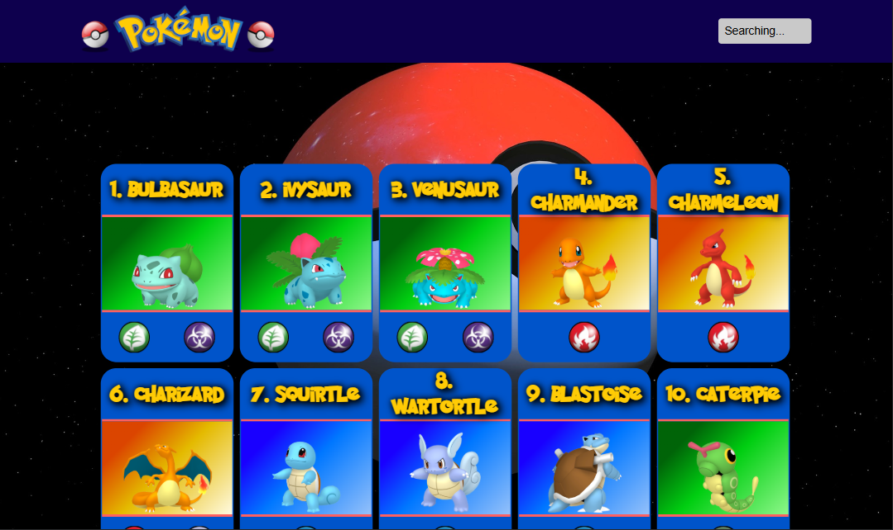

# Pokedex Web App

A responsive Pokédex web application built with **HTML, CSS and JavaScript** using the **PokeAPI**.

The app allows users to browse Pokémon, search by name and view detailed information including stats, abilities, types and Pokédex descriptions.

---

## 🚀 Live Demo

👉 [Live Demo](https://zeroger001.github.io/pokedex-app/)

---

## 📸 Preview



---

## ✨ Features

- Display Pokémon from the PokeAPI
- Search Pokémon by name
- Responsive card layout
- Detailed Pokémon view in a Lightbox
- Pokémon types with icons
- Evolution display
- Pokédex description loading
- Load more Pokémon functionality
- Scroll to top button

---

## 🛠 Technologies

- HTML5
- CSS3
- JavaScript (ES6)
- REST API
- PokeAPI
- Git
- GitHub Pages

---

## 📂 Project Structure

```
pokedex-app
│
├── img
├── script
│   ├── buttons.js
│   ├── hover.js
│   ├── input.js
│   ├── intro.js
│   ├── lightbox.js
│   ├── loader.js
│   ├── renderPokemonCard.js
│   └── script.js
│
├── style
│
├── index.html
├── impressum.html
└── datenschutz.html
```

---

## 👨‍💻 Author

Stefan Seegets

GitHub:  
https://github.com/Zeroger001
